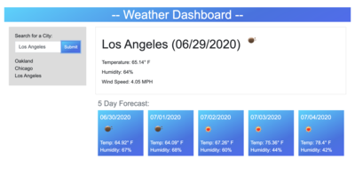

# Weather Dashboard



This is an application that uses a third-party API that access weather forecast data. The data is dynamically updated and provides forecast data for five days.

## Deployed Link

* [See Live Site](https://gnoisy.github.io/06-weather-dashboard/)

## Prerequisites

You'll need an IDE such as VS Code or Atom. Copy and paste code into your IDE and you can save file to your local drive.

```
https://code.visualstudio.com/download

https://flight-manual.atom.io/getting-started/sections/installing-atom/
```

## Built With

* [Javascript](https://developer.mozilla.org/en-US/docs/Web/JavaScript)
* [OpenWeather API](https://openweathermap.org/)
* [jQuery](https://jquery.com/)
* [HTML](https://developer.mozilla.org/en-US/docs/Web/HTML)
* [CSS](https://developer.mozilla.org/en-US/docs/Web/CSS)
* [Moment.js](https://momentjs.com/)

## Authors

* **Giovanni Noisy**

- [Link to Github](https://github.com/GNoisy)
- [Link to LinkedIn](https://www.linkedin.com/in/giovanni-noisy-04098989/)

### Acknowledgments

* Stack Overflow
* MDN 
* w3schools
* Google
* Youtube
